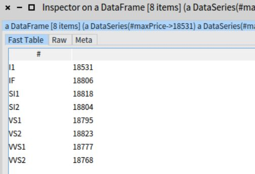

# Data Science and Smalltalk
---
All Data Science examples are developed using R and Python. However being an old, or should I say ***seasoned***, Smalltalker I couldn't withstand the challenge to write one example in **Smalltalk**. Yes, I was surprised to read that **Pharo** makes Data Science possible using packages like [DataFrame](https://github.com/PolyMathOrg/DataFrame), [PolyMath](https://github.com/PolyMathOrg/PolyMath) and [Roassal](https://github.com/ObjectProfile/Roassal2), just to mention a few. All packages are well documented, so there was no obstacle to just try this out in Pharo.<br>
## Diamonds
---
I chose the [Diamonds example](../R/DiamondsDemo.ipynb) that was my first excercise in R. Just some parts that demonstrate the use of the packages DataFrame (table structures) and Roassal (visualisation) are ported to Smalltalk. The input is the `diamonds.csv` file.


### Pharo
---
Pharo is an open-source Smalltalk environment. If not already installed you can [download Pharo](https://pharo.org/) freely for MacOS, Unix or Windows systems.<br>
The code has been extracted the old fashioned way using `file out` instead of the modern approach to share Pharo code like Monticello and Iceberg. 


### Loading Code
---
Open a Playground in your Pharo image. First execute the following Metacello scripts (succesively select and press the Do-it button) to load the necessary Data Science packages:
```smalltalk
    Metacello new
    baseline: 'DataFrame';
    repository: 'github://PolyMathOrg/DataFrame/src';
    load.

Metacello new
    baseline: 'Roassal3';
    repository: 'github://ObjectProfile/Roassal3:v0.9.3';
    load.
```
Then copy the Diamonds ST files to your local environment and, in Pharo's File Browser, use `Filein` to load into your image.  

### Usage
---
Start creating an instance of DiamondsLoader. The data from `diamonds.csv` is cleaned, sorted by price and loaded into your image as a DataFrame object.
```smalltalk
diamondsDF := DiamondsLoader new loadData.
diamondsDF dimensions.
diamondsDF columnNames.
```
Inspecting the last two statements above to display information on the size (number of rows and columns) and the remaining columns after cleaning.

The following command
```smalltalk
subDiamonds := diamondsDF head.
````
results in this data frame:


One of the diamond properties is the clarity. To find the amount of diamonds per clarity, do:
```smalltalk
diamondsCount := (diamondsDF column: #clarity) valueCounts.
```

It returns a `DataSeries` object, a dictionary with keys representing the names of the clarity categories and values the count. For a similar graphical representation as histogram select the code below and press the Do-it button:
```smalltalk
ddArr := diamondsCount values.
x := 1 to: ddArr size.
y := ddArr.
c := RSChart new.
p := RSBarPlot new x: x y: y.
c addPlot: p.
c addDecoration: (RSHorizontalTick new fromNames: diamondsCount keys asOrderedCollection).
c addDecoration: (RSVerticalTick new numberOfTicks: 8).
c xlabel: 'Clarity'.
c ylabel: 'Count'.
c title: 'Diamonds'.
c open.
```

<br><br>
To see the highest diamonds price per clarity:
```smalltalk
priceyDiamondsClarity := diamondsDF groupBy: #clarity
	aggregate: { 
		#price using: #max as: #maxPrice }.
```


<br><br>
The average price per clarity group for cut Premium and carat values between 1 and 2
```smalltalk
(diamondsDF select: [:x | (x at: #cut) = 'Premium' and: [(x at: #carat) between: 1 and: 2 ]]) groupBy: #clarity 
	aggregate: { 
		#price using: #average as: #meanPrice }.
```


```python

```
